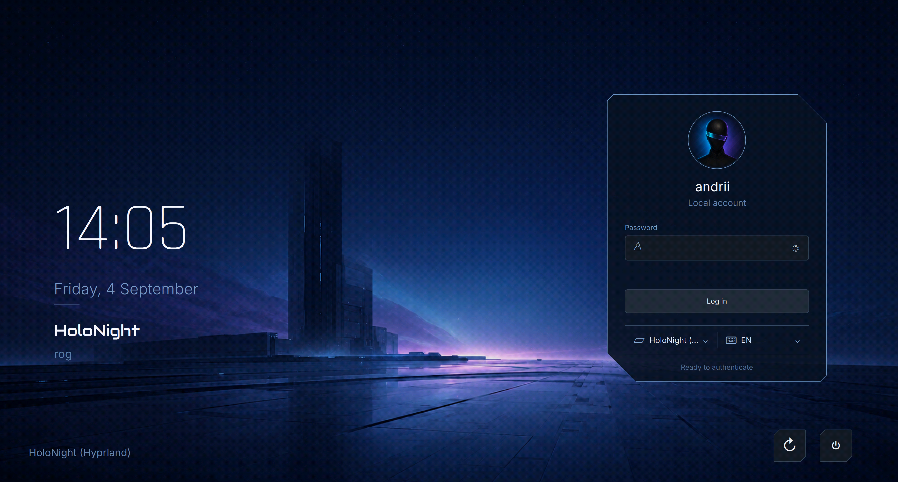

# HoloNight Greeter

A Qt 6 / QML [greetd](https://sr.ht/~kennylevinsen/greetd/) greeter for the HoloNight desktop.



## Features

- Fullscreen Wayland surfaces on every connected output, with a configurable primary output
- Local account discovery with UID, allowlist, denylist, locked-account, and avatar filtering
- Wayland session discovery and persisted last-user/last-session selection
- Configurable keyboard layouts and runtime layout switching under Hyprland
- Password, multi-step, and fingerprint authentication prompts through greetd
- Confirmed reboot and power-off actions through logind
- Windowed demo scenarios with simulated authentication and no privileged side effects
- Built-in isolated Hyprland launcher, with Cage available as an explicit rescue backend

## Requirements

Building requires a C++23 compiler, CMake 3.25 or newer, Ninja, Qt 6.11 (`Core`, `Gui`, `Quick`, `Qml`, `Network`,
`DBus`, and `Test` when tests are enabled), `layer-shell-qt`, toml++, HoloNight Qt 0.1.1 (`Core` and `Controls`),
and GTest, Python 3, and the Qt QML private headers when tests are enabled.

Production additionally requires greetd, logind, and either Hyprland (the default) or Cage. Layer shell binds each
fullscreen greeter surface to its intended Wayland output.

## Build and test

Task builds the pinned configuration and Qt provider revisions from sibling checkouts
into `build/dependencies/prefix`, without a system installation:

```sh
task build
task test
task lint
task tidy
task runtime-launches
```

Override `HOLONIGHT_CONFIG_SOURCE` and `HOLONIGHT_QT_SOURCE` when the dependency
checkouts are elsewhere. Their revisions must match the pins in `Taskfile.yml`.
For already installed dependencies, direct CMake configuration remains supported:

```sh
cmake -S . -B build -G Ninja -DBUILD_TESTING=ON -DCMAKE_PREFIX_PATH=/path/to/prefix
cmake --build build
ctest --test-dir build --output-on-failure
```

Application QML uses `QtQuick.Controls as Controls`. Each graphical executable
embeds a Holonight style default; `QT_QUICK_CONTROLS_STYLE=Fusion`, `-style Fusion`,
and an external `QT_QUICK_CONTROLS_CONF` remain supported. Core/composites retain
their HoloNight visuals. Installed QML discovery is relative to the executable.

## Demo

Run the greeter as a regular window from an existing graphical session:

```sh
# For the privately staged Task build:
export LD_LIBRARY_PATH="$PWD/build/dependencies/prefix/lib${LD_LIBRARY_PATH:+:$LD_LIBRARY_PATH}"
./build/holonight-greeter --demo
./build/holonight-greeter --demo-scenario wrong-password
./build/holonight-greeter --demo-scenario otp
./build/holonight-greeter --demo-scenario fingerprint
```

Supported scenarios are `default`, `wrong-password`, `otp`, and `fingerprint`; specifying a scenario implies
`--demo`. The demo uses configured read-only account and session discovery, including local display names and
avatars. Authentication, saved state, greetd communication, and logind actions are deterministic simulations.

On a compositor with `grim` and `slurp`, capture the demo with:

```sh
grim -g "$(slurp)" greeter.png
```

## Configuration

The sample [configuration](config/greeter.toml) covers:

- the `hyprland` or `cage` compositor backend and optional primary output;
- listed or manually entered users, UID bounds, filters, and avatars;
- session search directories, filters, and default session;
- keyboard layouts, variants, labels, and XKB options; and
- the background image path.

Configuration uses a strictly validated TOML v1 schema. Production defaults to `/etc/holonight/greeter.toml` and
accepts `--config PATH` and `--state PATH`. A missing configuration is nonfatal and uses compiled defaults; invalid
configuration disables authentication. Accounts without an assigned avatar use the fallback image bundled into the
executable. The system installation also provides optional faces under `/usr/share/pixmaps/faces`.

## System installation

Configure with the `/usr` prefix so GNUInstallDirs places machine configuration under `/etc`, then install and
provision the greeter state directory:

```sh
cmake -S . -B build-system -G Ninja -DCMAKE_BUILD_TYPE=Release \
  -DBUILD_TESTING=OFF -DCMAKE_INSTALL_PREFIX=/usr
cmake --build build-system
sudo cmake --install build-system
sudo systemd-tmpfiles --create holonight-greeter.conf
```

`task install:system` performs the same steps. Installation intentionally does not modify
`/etc/greetd/config.toml`. After preserving the administrator-owned configuration, merge the relevant values from
[the greetd example](deploy/greetd-config.toml). Its greeter command is:

```sh
/usr/bin/holonight-greeter-session --config /etc/holonight/greeter.toml
```

The launcher uses an isolated Hyprland instance by default and generates its private configuration under `/run`.
Select Cage in `greeter.toml` or override it explicitly with `--backend cage`. Startup failure is returned to greetd;
there is no automatic fallback between backends.

For a repository build on an isolated VT without replacing the installed greeter or primary greetd configuration,
run `task live:test`. See the [compositor deployment and recovery guide](docs/CAGE.md) before live testing or changing
the production login path.

## Documentation

- [MVP specification](docs/sdd/greeter-mvp/SPEC.md)
- [MVP design](docs/sdd/greeter-mvp/DESIGN.md)
- [Compositor deployment, live testing, and recovery](docs/CAGE.md)

## License

GPL-3.0-or-later — see [LICENSE](LICENSE).
